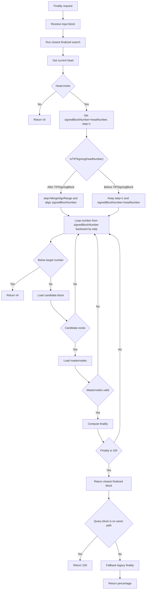

# Finality Lookup Flow

## API flow

For `GetBlockFinalityByHash` and `GetBlockFinalityByNumber`:

1. Resolve the input block.
2. Run strict finality check via `findClosestFinalizedBlock(ctx, blockNumber)`.
3. If closest finalized block is found and queried block is on same path, return `100`.
4. Otherwise fallback to legacy percentage finality (`findFinalityOfBlock`).

## `findClosestFinalizedBlock` flow

`findClosestFinalizedBlock(ctx, targetNumber)`:

1. Read head number as `headNumber`.
2. Initialize `signedBlockNumber = headNumber`, `step = 1`.
3. Handle 2 cases around `TIPSigningBlock` (via `IsTIPSigning(headNumber)`):
   - **Before TIPSigningBlock**: keep `step = 1`, start from `signedBlockNumber = headNumber`.
   - **After TIPSigningBlock**: set `step = common.MergeSignRange`, align start:
     `signedBlockNumber = headNumber - (headNumber % step)`.
4. Scan backward from `signedBlockNumber`:
   - loop by `number -= step`
   - stop early if `targetNumber > 0 && number < targetNumber`
5. For each `number`, check block finality and return first `100%` match.

## Notes

- This reduces scan cost versus checking every block.
- Before `TIPSigningBlock`: per-block scan (`step = 1`).
- After `TIPSigningBlock`: aligned checkpoint scan (`step = MergeSignRange`).
- Same-path checks are required before returning `100`.
- There is no reorg-pivot shortcut in the current implementation.

## Flow Diagram

